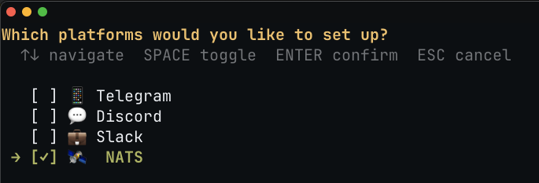
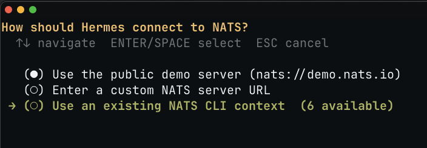

# hermes-agent

> **Work in progress.** The NATS gateway lives on a fork
> ([`synadia-ai/hermes-agent`, branch `nats-gateway`](https://github.com/synadia-ai/hermes-agent/tree/nats-gateway));
> upstream PR to [`NousResearch/hermes-agent`](https://github.com/NousResearch/hermes-agent)
> is planned but not yet filed (needs a catch-up rebase first), so the
> install below clones the fork directly.

NATS gateway for [Hermes Agent](https://github.com/NousResearch/hermes-agent), implementing the **[Synadia Agent Protocol for NATS](https://github.com/synadia-ai/nats-agent-sdk-docs) v0.3**.

Hermes is a self-improving coding agent with a CLI, a TUI, and a messaging gateway sharing one agent core. With the NATS gateway enabled, each running Hermes instance becomes a discoverable, addressable, streaming agent on NATS. Callers using any SDK that speaks the protocol — e.g. [`synadia-ai-agents`](../../client-sdk/python) (Python; import root `synadia_ai.agents`) or [`@synadia-ai/agents`](../../client-sdk/typescript) (TypeScript) — can enumerate running Hermes instances, prompt them (with attachments), and stream responses back.

Sibling implementations sharing the same wire protocol: [`pi`](../pi) (PI), [`openclaw`](../openclaw) (OpenClaw), [`claude-code`](../claude-code) (Claude Code).

## Install

Clone the fork, bootstrap Hermes, then let the setup wizard write your `platforms.nats` block. Power-users who'd rather hand-edit `~/.hermes/config.yaml` can skip the wizard and jump to [Configure](#configure).

**Clone and bootstrap.**

```bash
git clone -b nats-gateway https://github.com/synadia-ai/hermes-agent.git
cd hermes-agent
./setup-hermes.sh
```

`setup-hermes.sh` installs Hermes, prompts for an LLM provider key, and ends with:

```
Would you like to run the setup wizard now? [Y/n]
```

Press `ENTER` (or `Y`) to launch it. If you decline, you can run it later with `hermes setup` and pick **Quick Setup**.

**Pick NATS in the platform menu.** Quick Setup opens with a multi-select. The initial first-run wizard shows a longer list of platforms; the NATS choice is the same:



Toggle **NATS** with `SPACE` and confirm with `ENTER`.

**Choose how Hermes connects to NATS.**



- **`Use the public demo server (nats://demo.nats.io)`** — zero-config, public, ephemeral. Fine for a first smoke test, **not** for anything sensitive.
- **`Enter a custom NATS server URL`** — point at your own `nats-server` or a Synadia Cloud cluster.
- **`Use an existing NATS CLI context`** — picks one of your `~/.config/nats/context/*.json`. Recommended for anything beyond the demo server; see [Via a NATS CLI context](#via-a-nats-cli-context-recommended-for-anything-beyond-demonatsio) below for how to create one.

**Owner and session name.** The wizard then prompts for:

- `Owner` — 4th subject token, e.g. your GitHub handle.
- `Session name` — 5th subject token; one service = one session.

See [Subject hierarchy](#subject-hierarchy-v03-verb-first) for the full layout.

**Confirmation.** The wizard prints:

```
NATS configured: agents.prompt.hermes.<owner>.<session>
```

**Start the gateway.** Near the end the wizard asks whether to install the gateway as a `systemd` (Linux) or `launchd` (macOS) service that runs in the background and starts on boot. If you accepted, it's already running — skip ahead to [Verify](#verify). If you declined, run it in the foreground (Ctrl+C to stop):

```bash
hermes gateway run
```

You'll see the startup banner and a warning about user allowlists:

```
┌─────────────────────────────────────────────────────────┐
│           ⚕ Hermes Gateway Starting...                  │
├─────────────────────────────────────────────────────────┤
│  Messaging platforms + cron scheduler                   │
│  Press Ctrl+C to stop                                   │
└─────────────────────────────────────────────────────────┘

WARNING gateway.run: No user allowlists configured. All unauthorized users will be denied. Set GATEWAY_ALLOW_ALL_USERS=true in ~/.hermes/.env to allow open access, or configure platform allowlists (e.g., TELEGRAM_ALLOWED_USERS=your_id).
```

The allowlist warning is harmless for a NATS-only setup — it gates Telegram/Discord/Slack-style DMs, where Hermes needs to know who's allowed to talk to it. NATS access is gated at the broker (account + subject permissions), not via gateway allowlists, so you can ignore the warning until you wire up another platform.

Confirm the gateway registered as expected via [Verify](#verify) below. (For more verbose logs in the foreground — including the `[Nats] Connected — subscribed at …` line — re-run with `hermes gateway run -v`.)

You can install the gateway as a service later with `hermes gateway install`. For manual `config.yaml` edits or to go beyond what the wizard covers, see [Configure](#configure) below.

## Configure

Use this section if you skipped the wizard, want raw YAML, or need fields the wizard doesn't surface (e.g. `max_payload`, `heartbeat_interval_s`, custom `agent` token). All settings live under `platforms.nats` in `~/.hermes/config.yaml`. The `owner` and `session_name` fields determine your subject — `agents.prompt.hermes.<owner>.<session_name>`.

### Minimal `demo.nats.io` setup

No credentials, ephemeral public server — perfect for a first smoke test, not for anything sensitive:

```yaml
platforms:
  nats:
    enabled: true
    extra:
      servers: ["nats://demo.nats.io"]
      owner: yourname             # e.g. your github handle
      session_name: demo          # 5th subject token; pick one per profile
      attachments_ok: true
```

### Via a NATS CLI context (recommended for anything beyond `demo.nats.io`)

If you already manage NATS credentials via `nats context`, reference the context by name. This keeps URLs and creds out of `config.yaml` and lets you flip between local, Synadia Cloud, and production by changing one field.

Create a context (example: a local `nats-server` on 4223 with no auth):

```bash
nats context add hermes-local \
  --server nats://127.0.0.1:4223 \
  --description "Hermes local dev"
nats context select hermes-local
nats --context hermes-local rtt       # sanity check the connection
```

This writes `~/.config/nats/context/hermes-local.json`:

```json
{
  "description": "Hermes local dev",
  "url": "nats://127.0.0.1:4223"
}
```

Reference it from `~/.hermes/config.yaml`:

```yaml
platforms:
  nats:
    enabled: true
    extra:
      context: hermes-local       # reads ~/.config/nats/context/hermes-local.json
      owner: rene
      session_name: local
      attachments_ok: true
      # Optional tuning (defaults shown):
      # agent: hermes                # 3rd subject token; rarely changed
      # max_payload: "1MB"           # pattern \d+(B|KB|MB|GB); see "Config fields"
      # heartbeat_interval_s: 30
```

With the example above, Hermes registers at `agents.prompt.hermes.rene.local` and publishes heartbeats on `agents.hb.hermes.rene.local`.

For Synadia Cloud or a secured self-hosted server, add the relevant fields when creating the context (`--creds`, `--nkey`, `--user`/`--password`, `--tls*`) — see `nats context add --help`.

### Config fields

All fields live under `platforms.nats.extra` in `~/.hermes/config.yaml`.

| Field | Required | Default | Description |
|-------|----------|---------|-------------|
| `context` | one of `context`/`servers` | — | NATS CLI context name in `~/.config/nats/context/` |
| `servers` | one of `context`/`servers` | — | List of NATS URLs, e.g. `["nats://demo.nats.io"]` |
| `owner` | yes | — | 4th subject token — your operator / account namespace |
| `session_name` | yes | — | 5th subject token — fixed per service (multi-session = multi-profile) |
| `agent` | no | `hermes` | 3rd subject token; rarely changed |
| `attachments_ok` | no | `true` | Accept inline base64 attachments |
| `max_payload` | no | server-negotiated | Per-request advertised limit; must match `\d+(B\|KB\|MB\|GB)`. Defaults to `nc.info.max_payload` (1 MB on a default `nats-server`). A configured value is honored up to the server limit; if it's larger, the SDK clamps the advertised value down to the server's limit and logs a warning — anything bigger would be rejected by the broker before reaching your handler. Set this only when you want to advertise a *smaller* cap to shed expensive prompts client-side. |
| `heartbeat_interval_s` | no | `30` | Liveness beacon interval |

### Environment variables (optional)

Any `NATS_*` / `HERMES_NATS_*` env var flips `platforms.nats.enabled=true` automatically, so you can skip the YAML edit for a quick smoke test:

| Variable | Overrides |
|----------|-----------|
| `NATS_URL` | `extra.servers` (single URL) |
| `NATS_CONTEXT` | `extra.context` |
| `HERMES_NATS_OWNER` | `extra.owner` |
| `HERMES_NATS_SESSION_NAME` | `extra.session_name` |
| `HERMES_NATS_AGENT` | `extra.agent` |

Each env var overrides the corresponding [config field](#config-fields) above; defaults live there.

## Verify

```bash
# Micro service listing — Hermes should appear
nats --context hermes-local micro list
nats --context hermes-local micro info agents

# On-demand liveness via the v0.3 status endpoint (returns the current heartbeat-shaped JSON)
nats --context hermes-local req agents.status.hermes.rene.local '' --timeout=2s

# Watch heartbeats — one frame every heartbeat_interval_s seconds
nats --context hermes-local sub 'agents.hb.>'
```

Omit `--context hermes-local` if you're using the default/`demo.nats.io` path.

## Talking to a running Hermes agent

### Plain-text prompt

With the Python SDK's shipped examples (from this monorepo):

```bash
# From the synadia-agents repo root:
cd client-sdk/python
uv run python examples/02-prompt-text.py \
    --context hermes-local \
    --session local \
    "what is 2+2? answer in exactly one short sentence."
```

`--session local` selects the agent whose `session_name` matches; omit it to take the first discovered agent. You'll see the response stream chunk-by-chunk, terminated by an empty frame.

Or with the `nats` CLI directly (plain-text shorthand per spec §5.1):

```bash
nats --context hermes-local req agents.prompt.hermes.rene.local \
    "what is 2+2? answer in one short sentence." \
    --timeout 30s
```

The CLI prints only the first response chunk — for the full streamed body, use the SDK example.

### With an attachment — "describe this image"

Hermes routes images through its `vision_analyze` tool, so the model actually sees the picture. The Hermes repo ships a small banner (`website/static/img/hermes-agent-banner.png`, ~12 KB — well under the 1 MB payload limit):

```bash
# from synadia-agents/client-sdk/python. The ../../../hermes-agent/...
# path assumes hermes-agent is cloned as a sibling of synadia-agents;
# any local image works otherwise.
uv run python examples/03-prompt-attachment.py \
    --context hermes-local \
    --session local \
    --prompt "describe this image in one sentence" \
    ../../../hermes-agent/website/static/img/hermes-agent-banner.png
```

Expected: a short description of the banner — what it depicts, colors, text — streamed back as `response` chunks.

### With the Python SDK (programmatic)

```python
import asyncio
import nats
from synadia_ai.agents import Agents, DiscoverFilter, ResponseChunk, load_context_options

async def main():
    nc = await nats.connect(**load_context_options("hermes-local"))
    agents = Agents(nc=nc)

    # Discover Hermes by its session_name (the 5th subject token).
    found = await agents.discover(filter=DiscoverFilter(session_name="local"))
    if not found:
        print("no hermes agent registered for session_name=local")
        return
    hermes = found[0]

    async for msg in hermes.prompt("list three interesting CLI tools"):
        if isinstance(msg, ResponseChunk):
            print(msg.text, end="", flush=True)
    print()

    await agents.close()
    await nc.close()

asyncio.run(main())
```

To talk to a *different* conversation, point `DiscoverFilter(session_name=...)` at a different value — and run a separate Hermes profile registering that `session_name`. See "Multiple sessions" below.

### Other example scripts

| Script | Demonstrates |
|--------|--------------|
| `examples/01-discover.py` | Enumerate every agent registered on the server via `$SRV` |
| `examples/02-prompt-text.py` | Plain-text prompt + streamed response |
| `examples/03-prompt-attachment.py` | Attachment upload (the demo above) |
| `examples/04-query-reply.py` | Handle a mid-stream approval `query` chunk (Hermes asks before running dangerous tools) |
| `examples/05-liveness.py` | Watch heartbeats, detect the agent going offline |
| `examples/06-chat.py` | Multi-turn chat against one selected agent |

All honor `--context`, `--url`, `$NATS_URL`, or `nats context select` (in that order). Examples that take a target agent honor `--session NAME` to filter by `session_name`.

## How it works

When `hermes gateway run` starts with `platforms.nats.enabled = true`:

1. Connects to NATS using a configured context (or `demo.nats.io` by default via `$NATS_URL`).
2. Registers a NATS micro service named `agents` with v0.3 spec metadata (`agent`, `owner`, `protocol_version`).
3. Adds a `prompt` endpoint at `agents.prompt.hermes.<owner>.<session_name>` advertising the server-negotiated `max_payload` (read from `nc.info.max_payload` and formatted into the §2.1 `\d+(B|KB|MB|GB)` grammar — `1MB` against a default `nats-server`; a YAML `max_payload` setting overrides this *down* but is clamped if larger than the server allows) and `attachments_ok: true`, and a `status` endpoint at `agents.status.hermes.<owner>.<session_name>` for on-demand liveness.
4. Publishes heartbeats on `agents.hb.hermes.<owner>.<session_name>` every 30 s.
5. On each inbound prompt: decodes any attached files to the gateway's attachment staging area, routes images through Hermes's `vision_analyze` tool so the agent actually sees them, emits a `status: ack` chunk, runs the full Hermes agent loop (tools, memory, skills, approvals) to completion, and streams model output back as typed `{type:"response","data":…}` chunks, terminating with the spec-mandated empty-body no-headers terminator.
6. Malformed envelopes, oversized payloads, invalid base64, and unsafe filenames are rejected at the wire with `Nats-Service-Error-Code: 400`. Internal failures return `500`.
7. Mid-stream approval prompts (dangerous tool calls) are surfaced as spec §7 `query` chunks when a caller drives a prompt; see `examples/04-query-reply.py` in the SDK.

**Single-session-per-service (v0.3 §-PR #26).** One Hermes gateway = one `AgentService` = one `session_name` (the 5th subject token). For multiple isolated sessions on one host, run multiple **Hermes profiles** — each profile registers its own service with its own `session_name`. This matches the way pi/openclaw/claude-code already work; the v0.2 `envelope.session` demux is gone.

## Subject hierarchy (v0.3 verb-first)

```
agents.prompt.hermes.<owner>.<session_name>     # prompt endpoint (spec §2, §5)
agents.status.hermes.<owner>.<session_name>     # on-demand liveness request/reply
agents.hb.hermes.<owner>.<session_name>         # heartbeat beacon (spec §8)
```

- `hermes` is `metadata.agent` and the 3rd subject token.
- `owner` (4th token): from `platforms.nats.extra.owner` — operator/account namespace.
- `session_name` (5th token): from `platforms.nats.extra.session_name` — fixed per `AgentService`. Each Hermes profile registers exactly one service with one `session_name`.

Caller-side replies use the pinned `_INBOX.agents` prefix (v0.3 §-PR #25); for tight NATS account permissions, grant `_INBOX.agents.>` to caller principals.

## Multiple sessions (Hermes profiles)

Pi, OpenClaw, Claude Code, and now (under v0.3) Hermes all follow the same model: **one NATS identity per process**. To run multiple isolated conversations from one host, use Hermes's profile mechanism — each profile gets its own `HERMES_HOME` (config, sessions, memory, skills, gateway) and registers its own `AgentService` at a distinct `session_name`:

```bash
hermes -p alice profile create
hermes -p alice setup            # configure HERMES_NATS_SESSION_NAME=alice (or set in config.yaml)
hermes -p alice gateway run

hermes -p bob profile create
hermes -p bob setup              # configure HERMES_NATS_SESSION_NAME=bob
hermes -p bob gateway run
```

Each profile registers a distinct subject:

- alice: `agents.prompt.hermes.<owner>.alice`
- bob:   `agents.prompt.hermes.<owner>.bob`

A caller picks a session by either filtering discovery (`DiscoverFilter(session_name="alice")`) or addressing the subject directly. Histories are fully isolated because they live in separate `HERMES_HOME` directories.

## Tenant isolation

The spec reserves the five-token subject structure; there is no additional namespace slot. For multi-tenant isolation, use NATS accounts and subject permissions (spec §10.1). Within an account, Hermes's scoped lock prevents two gateway instances from registering the same `(agent, owner, session_name)` triple on one machine — the second fails fast with an actionable error.

Cross-machine collisions are deliberately allowed — the protocol permits multiple instances per identity (§3.3) for high availability.

## Wire protocol (summary)

Full spec: <https://github.com/synadia-ai/nats-agent-sdk-docs>. Quick reference:

- **Request**: plain UTF-8 text OR JSON `{"prompt":"…","attachments":[{"filename":"…","content":"<base64>"},…]}`. Attachment `content` must be RFC 4648 §4 base64 (standard alphabet, padded, no URL-safe variant, no whitespace). Under v0.3 the envelope no longer carries a `session` field — the session IS the subject's 5th token.
- **Response**: typed chunks on the reply subject — `{"type":"status","data":"ack"}` (accepted / keep-alive), `{"type":"response","data":"<text>"}` (content), `{"type":"query","data":{…}}` (mid-stream approval).
- **Terminator**: empty body **and no headers** (§6.5).
- **Errors**: `Nats-Service-Error-Code` header with `400`/`500`, followed by the terminator.

## Limitations

Current deferrals (candidates for future phases, not bugs):

- **No cron-driven proactive delivery over NATS.** NATS has no persistent reply address a cron job could target.
- **No `send_message` tool routing to NATS.** Same reason.
- **No chunked `attachments` endpoint** (spec §5.5). Inline base64 only for now.
- **No JetStream at-least-once delivery.**
- **No E2E encryption** — delegated to NATS server TLS.
- **`/stop` doesn't interrupt a running NATS turn.** The adapter-owned agent pattern bypasses the gateway's `_active_sessions` tracking; callers drop their subscription to abandon a run.
- **No multi-session multiplexing within one process.** v0.3 fixed: one `AgentService` = one `session_name`. Use Hermes profiles for multiple sessions.

## Troubleshooting

- **`NATS: synadia-ai-agents / synadia-ai-agent-service SDKs not installed` at gateway startup.** The `[nats]` extra wasn't installed. Re-run `./setup-hermes.sh`, or `uv sync --all-extras --locked` from the hermes-agent clone. If `setup-hermes.sh` should have done this for you, it's a packaging bug — file an issue.
- **Gateway not discovered / `nats micro list` returns nothing.** Gateway didn't register. Check `platforms.nats.enabled: true`, that the NATS URL/context resolves, and look for `[Nats] Connected — subscribed at …` in the gateway log. (That line logs at INFO; in the foreground you need `hermes gateway run -v` to surface it — `hermes gateway run` defaults to WARNING. For an installed service, check the systemd/launchd journal.) If another Hermes instance already holds the same `(agent, owner, session_name)` on this host, the log shows `NATS agent identity hermes:<owner>:<session_name> already in use (PID …)`.
- **Stale platform lock blocks restart.** Lives at `~/.local/state/hermes/gateway-locks/nats-<hash>.lock`. Verify the recorded PID is dead (`ps -p <PID>`), then `rm` the file.
- **`nats req` returns only one chunk.** That's expected — `nats request` shows the first reply. For the full streamed body use `examples/02-prompt-text.py` (or any caller iterating the SDK's async iterator).
- **Caller hangs after the first chunk; `is_online()` returns False.** Gateway probably crashed or lost NATS connectivity. The protocol marks an agent offline after ~3 missed heartbeats (~90 s at the 30 s default). Check the gateway log (foreground: re-run with `hermes gateway run -v` to surface INFO output; service: systemd/launchd journal), or query `agents.status.hermes.<owner>.<session_name>` directly.
- **Dangerous command hangs for 5 minutes then fails.** The caller didn't handle the `query` chunk. Drain `query` in your SDK loop (see `examples/04-query-reply.py`) — after `gateway_timeout` (default 300 s) the command is auto-denied.
- **`400 attachment[N] has invalid base64 content`.** The caller emitted URL-safe base64 or unpadded output. Switch to RFC 4648 §4 (standard alphabet, padded).
- **`ValueError: could not parse max_payload '…'`.** `max_payload` must match `\d+(B|KB|MB|GB)` — e.g. `"1MB"`, `"512KB"`, `"104857600B"`.

## Further reading

- **Hermes user guide for the NATS channel:** [`website/docs/user-guide/messaging/nats.md`](https://github.com/synadia-ai/hermes-agent/blob/nats-gateway/website/docs/user-guide/messaging/nats.md) in the fork — deep dive on configuration, subject layout, multiple sessions via profiles, attachments, full troubleshooting table.
- **Architecture & design:** [`docs/nats-gateway-design.md`](https://github.com/synadia-ai/hermes-agent/blob/nats-gateway/docs/nats-gateway-design.md) — protocol↔adapter mapping, streaming model, approval hook, failure modes, and §17 retrospective lessons (including the v0.3 migration addenda).
- **Adapter source:** [`gateway/platforms/nats.py`](https://github.com/synadia-ai/hermes-agent/blob/nats-gateway/gateway/platforms/nats.py).
- **Protocol spec:** <https://github.com/synadia-ai/nats-agent-sdk-docs>
